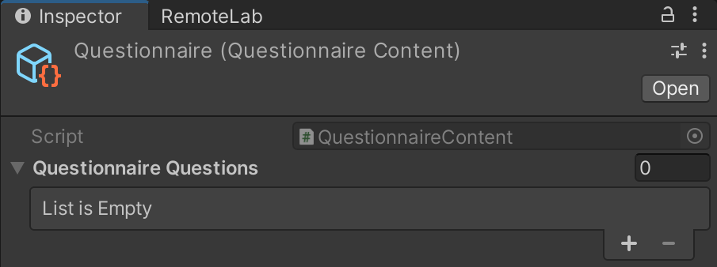
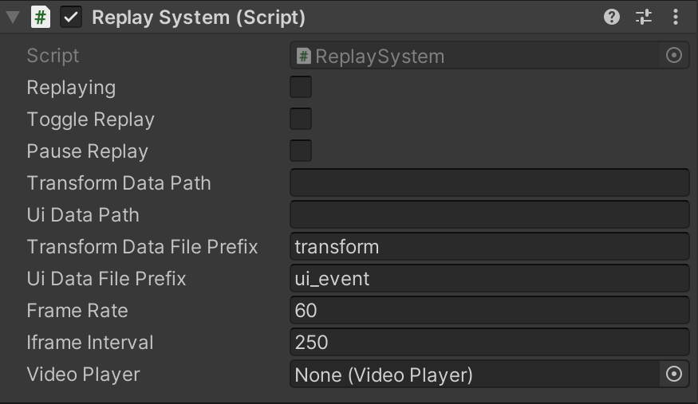

Contributors: Jaewook Lee (UW), Raahul Natarrajan (Vanderbuilt), Sebastian S. Rodriguez (UIUC), Payod Panda (MSR), Eyal Ofek (MSR)

# XR-Remote-Study-Toolkit

## Table of Contents
1. [About](#about)
2. [Installation](#installation)
3. [Usage](#usage)
    1. [Initial Setup](#initial_setup)
    2. [OBS Integration](#obs)
    3. [Recording Transform Data](#recording_transform)
        1. [Recording Non-Instantiated GameObjects](#recording_noninst)
        2. [Recording Instantiated GameObjects](#recording_inst)
    4. [Interactable UI](#interactable_ui)
    5. [Tracking Custom Variables](#custom_var)
    6. [Questionnaire](#custom_questionnaire)
    7. [Replay System](#replay_system)
4. [Example Study](#example)
5. [Contributors](#contributors)
6. [Contributing To This Project](#contributing)


## About <a name="about"></a>
The XR Remote study toolkit is a toolkit for Unity that allows users to record and replay gameplay from the Unity editor window. The toolkit currently allows users to track the changes in Transform for each GameObject in the scene, record UI events (Toggle, Button, and Slider events), note changes in user-defined variables, and implement custom Likert scale surveys and the raw NASA-TLX survey. 

This work was done as a collaboration wetween Microsoft Research and researchers from University of Washington, Vanderbuilt University and UIUC.
The work is described in a paper presented at UIST 2022, Bend, Oregon.

The reference for the paper is:

```@inproceedings{lee2022remotelab,
author = {Lee, Jaewook and Natarrajan, Raahul and Rodriguez, Sebastian S. and Panda, Payod and Ofek, Eyal},
title = {RemoteLab: Virtual Reality Remote Study ToolKit},
organization = {ACM},
booktitle = {UIST},
year = {2022},
month = {October},
publisher = {ACM},
url = {https://www.microsoft.com/en-us/research/publication/remotelab-virtual-reality-remote-study-toolkit/},
}
```

## Installation <a name="installation"></a>
Download the latest Unity package from the Releases section. Then, import the package into Unity by selecting `Assets > Import Package > Custom Package` from the Unity menu bar. The package contents will be imported into a folder called Replay System in the Unity Assets folder for your project.

## Usage <a name="usage"></a>

### Initial Setup <a name="initial_setup"></a>


First, open the RemoteLab panel by selecting `RemoteLab > Control Panel` from the Unity menu bar. The RemoteLab panel contains useful actions needed to successfully execute a study using RemoteLab's features.

To set up the recording system, add the `Replay Manager` prefab by clicking the `Replay` button located under `Add RemoteLab Manager to Scene`. 


The `Replay Manager` prefab contains the `ReplayManager` script, which controls the scene recording functionality. The `Transform Data File Prefix` determines the name of the CSV file containing the tracked Transform information. `Controller Data File Prefix` determines the name of the CSV file containing the tracked controller data. `UI Event Data File Prefix` determines the name of the CSV file containing the logged UI events. `Custom Variable Data File Prefix` determines the name of the CSV file containing the logged data for user-defined variables. 

The `Session Id` and `Participant Id` values determine where the data will be stored. If the `Session Id` is `session_1` and `Participant Id` is `participant_1`, then the recordings will be stored in `Assets/Recordings/session_1/participant_1`. Within the `Assets/Recordings/session_1/participant_1` folder, there will be one or multiple folders with time stamps as the name of the folder in the format of `MM-DD-YYYY_HH-MM-SS_XM`. Each folder will contain the recording files for recordings started at the time stamp indicated by the folder name.


In order to start recording, run the scene in the editor or click the `Start Experiment` button located under `Experiment Actions`. Then click the `Start Recording` button located under `Experiment Actions`. To stop recording, click the `Stop Recording` button located under `Experiment Actions`. To use OBS, toggle `Use OBS` on before clicking the `Start Experiment` button. More details will be provided in the [OBS section](#obs). The `Frame Rate` field in the `ReplayManager` script determines at what frame rate the system will record the gameplay. The `Recordables` list lets you visualize at runtime what objects are being tracked.

## OBS Integration <a name="obs"></a>
OBS Studio lets you record video through screen captures. If you are interested in recording your screen during the recording session, you can integrate OBS with this toolkit. First, you will need to install OBS Studio by downloading the appropriate package from [https://obsproject.com/](https://obsproject.com/). The rest of the instructions assumes that you are familiar with the OBS interface.

Next, you will need to install `obs-websocket` in order to allow the toolkit to interface with the OBS software. The software can be found at [https://github.com/obsproject/obs-websocket](https://github.com/obsproject/obs-websocket). Install the appropriate version for your OBS client. 

The toolkit interacts with the OBS software through the `OBS Manager`script located in the `ReplayManager` prefab. 


The `Obs Path` parameter sets the path to the directory that contains the OBS Studio executable. The `Url` paramter sets the endpoint that the toolkit should connect to in order to attach itself to the OBS software. This path is something you will set inside of the OBS Studio setting before running the toolkit. Similarly, the `Password` parameter is the password to connect to the URL endpoint for the OBS client. The `Wait For OBS Delay` setting lets you determine how long to wait for the OBS software to boot up in seconds before retrying. Adjust this setting based on how long software takes to boot up on your computer. The `RetryLimit` setting determines how many times the `OBS Manager` will retry a connection to the OBS software. If the `OBS Manager` reaches the retry limit, then the recording process will be aborted and nothing will be recorded. 

To record the screen using OBS alongside the toolkit, first set up the OBS displays beforehand in the OBS software. Then, verify that the `Use OBS` option is selected in the RemoteLab panel, as described in a previous paragraph. Make sure to select these settings before running the scene. Afterwards, run the scene and click the `Start Recording` button to start recording. Once you are finished, click the `Stop Recording` button to stop recording. 

## Recording Transform data for a GameObject <a name="recording_transform"></a>


In order to record the transform information for a GameObject during runtime, you need to add a `Recordable` component to that GameObject. To do so, click on the desired gameobject, then click the `Recordable` button located under `Add RemoteLab component to GameObject`. This will also automatically add the gameobject to the `Recordables` list.

### Recording Component for non-instantiated GameObject <a name="recording_noninst"></a>


The above picture shows the Recordable component for a non-instantiated GameObject (GameObject not created during runtime using a method call like `Instantiate()`). To finish the setup for a non-instantiated GameObject, select `Generate GUID` in order to generate a GUID for the GameObject. This is a unique ID for the GameObject used during the replay of a recording.

If the GameObject will be instantiated at runtime, you need to turn on `Is Instantiated At Runtime`. This selection will cause another section called `Resource Path` to pop up. 

### Recordable Component for instantiated GameObject <a name="recording_inst"></a>


This selection will also remove the `Generate GUID` button. If the GameObject is instantiated at runtime, make sure that the `Guid String` field is empty. The GUID is not set for instantiated objects for the recording and replay functions.

The `Resource Path` field is used to determine where the instantiated object is located in the Assets folder for the replay system so that the object can be instantiated accordingly. For the replay system to correctly find the instantiated object, put the GameObject in a folder labeled Resources such as `Assets/Resources`. 

Now, the GameObject with the Recordable component will have its Transform information recorded and ready for replay.

## Interactable UI <a name="interactable_ui"></a>
The XR Remote Study Toolkit can track UI events for buttons, toggles, and sliders. To track a UI event, add a `Interactable UI` component to the UI object in the scene through drag-and-drop or adding the component through the `Inspector`. 


The `Interactable Type` field is a drop-down menu, which lets you select one of the three types of UI events you want to track (button, toggle, slider). The `Guid String` field is filled by selecting the `Generate GUID` button. Generate the GUID for the component if the object containing the UI element will be instantiated at runtime. Otherwise, make sure to leave the `Guid String` field blank. 

The UI element with the `Interactable UI` component is ready for recording UI events.

## Tracking Custom Variables <a name="custom_var"></a>
In order to track user-defined variables like a member variable in a user-defined class, you need to set up the tracking mechanism through additional lines of code. For instance, suppose you have the following class.

```C#
using UnityEngine;

public class CustomVariableExample : MonoBehaviour
{
    private string m_someString;

    private void Start()
    {
        m_someString = "";
    }

    private void Update()
    {
        if (Input.GetKeyDown(KeyCode.Alpha1))
        {
            m_someString += "a";
            print("m_someString: " + m_someString);
        }
    }
}
```

If you want to track the change in value for `m_someString` during runtime, we need to make some modifications.

```diff
using UnityEngine;

public class CustomVariableExample : MonoBehaviour
{
    private string m_someString;
+   public string SomeString
+   {
+       get
+       {
+           return m_someString;
+       }
+       set
+       {
+           m_someString = value;
+           ReplayManager.Instance.WriteCustomVariableDataEntry("CustomVariableExample"
+               "m_someString", m_someString);
+        }
+   }

    private void Start()
    {
-       m_someString = "";
+       SomeString = "";
    }

    private void Update()
    {
        if (Input.GetKeyDown(KeyCode.Alpha1))
        {
-           m_someString += "a";
-           print("m_someString: " + m_someString);
+           SomeString += "a";
+           print("m_someString: " + SomeString);
        }
    }
}
```

To track the variable, we are creating a C# property that wraps around the variable we want to track so that we can add in the additional line that logs data anytime the variable is changed. So, we create an additional field called `SomeString`, a property that manipulates `m_someString`, where the `set` method is set up to log any changes in the variable. Within the `set` method, we call `ReplayManager.Instance.WriteCustomVariableDataEntry("CustomVariableExample", "m_someString", m_someString)`. The first parameter for this method call is the name of the script containing the tracked variable as a string. Next, the second parameter is the name of the tracked variable as a string. Finally, the last parameter is the value of the variable itself. Now, by calling this method whenever we set the variable, we can log changes to the variable during runtime. Now, we need to replace every instance where the codebase uses `m_someString` with `SomeString` so that the `set` method with the logging feature is activated correctly. So, we replace the uses of `m_someString` in the `Start()` and `Update()` methods with `SomeString`.

Now, this example code tracks the variable changes for `m_someString`. Here is the completed code.

```C#
using UnityEngine;

public class CustomVariableExample : MonoBehaviour
{
    private string m_someString;
    public string SomeString
    {
        get
        {
            return m_someString;
        }
        set
        {
            m_someString = value;
            ReplayManager.Instance.WriteCustomVariableDataEntry("CustomVariableExample",       "m_someString", m_someString);
        }
    }

    private void Start()
    {
        SomeString = "";
    }

    private void Update()
    {
        if (Input.GetKeyDown(KeyCode.Alpha1))
        {
            SomeString += "a";
            print("m_someString: " + SomeString);
        }
    }
}
```

## Questionnaire <a name="custom_questionnaire"></a>
We can easily create questionnaires using the XR Remote Study Toolkit. In order to make a custom questionnaire, first drag and drop the `Net Questionnaire` prefab from the `RemoteLab/Resources/Prefabs/Questionnaires/Resources` folder into the scene. Now, we must generate a `Questionnaire Content` object and drag and drop it into the `Questionnaire Content` parameter of `Net Questionnaire Manager` component and `Questionnaire Manager` component attached to the `Net Questionnaire` prefab.


In order to create a custom `Questionnaire Content` object for your questionnaire, click the `New Questionnaire` button located under `Add Questionnaire`. You should see an empty `Questionnaire Content` scriptable object.



You can populate the list by clicking on the `+` button or increasing the number of questionnaire questions to more then zero and filling in the corresponding details.

First, fill in the question.


Then, select a choice type. `Single` represents a multiple choice question where participants can only select one answer. `Multiple` represents a multiple choice question where participants can select multiple answers. Finally, `Slider` represents questions where participants can select a value from a range of values. Each choice type requires different parameters, which researchers can specify.


Finally, researchers can specify whether a question can be skipped (i.e., not provide an answer) by the participants or not. Simply toggle the `Can Skip Question` parameter to do so.

The toolkit provides you with a pre-made `LikertScale` `SUS` and `NASA TLX` Questionnaire Content objects for use, which can be found in the `RemoteLab/Resources/Prefabs/Questionnaires/Examples` folder. Please check them out to see how Questionnaire Content object can be expanded to fit different questionnaires.


Before using the questionnaire, make sure to generate the GUIDs for the previous, next, and skip button UI elements, which are called `PrevButton` `NextButton` and `SkipButton` respectively.

To use your created Questionnaire Content for the questionnaire, select the appropriate Questionnaire Content file as the parameter for the `Questionnaire Content` field in the `Net Questionnaire Manager` and `Questionnaire Manager` components.

Finally, drag and drop the questionnaire prefab as a new prefab into the `RemoteLab/Resources/Prefabs/Questionnaires/Resources` folder. This prefab is the networked questionnaire. In the `QuestionnaireManager` prefab, add the name of this prefab into the `Questionnaires to Spawn` list. Duplicate this prefab and rename it by adding `_local` at the end. Additionally, enable the `Questionnaire Manager` script, disable the `Net Questionnaire Manager` script, and uncheck `Is Instantiated at Runtime`. This is the local version of the questionnaire, which will be used by the replay system.

When a questionnaire is filled and submitted by a participant, the corresponding data is written to a CSV file with the following naming convention: nameOfTheQuestionnaireGameObject_questionnaire_data.csv.

## Setting up questionnaire and UI
In order to interact with the questionnaire objects and any other UI objects, you need to use or implement a form of UI interactor for your XR system. For instance, if you are using the Oculus (OVR) Integration, you need to add the `OVR Raycaster` to the top-level GameObject for any survey that you are using. Furthermore, you need to use some kind of UI input selector for your scene. For Oculus, we set up the UI interaction system using the `UIHelpers` prefab from the Oculus Integration package.

## Replay System <a name="replay_system"></a>
The replay system implemented in the toolkit replays whatever information was recorded in the CSV files for UI events and Transform changes. So, the replay does include the replaying of animations and in-game events that cannot be fully captured through changes in transform, instantiation, object destruction, activation, deactivation, and UI click, slide, and toggle events.

To set up the system for replay, first duplicate the scene to be replayed. Then, with the duplicated scene loaded, click on the `Set Up Replay` button located under `Experiment Actions` to transform the scene into a replay scene.

Now, go to the `Replay System` prefab and verify some parameters.



The `Transform Data Path` is used to determine what transform file to replay. The `Ui Data Path` is used to determine what UI data file to replay. `Transform Data File Prefix` is the prefix of the CSV file that contains the Transform data to replay. `Ui Data File Prefix` is the prefix of the CSV file that contains the UI event data to replay. Make sure that these values are set to replay the appropriate files. The default values for the prefixes assume that you did not modify the file prefixes in the `Replay Manager` component in the original scene. You need to verify that the absolute paths to the transform and UI data are valid for your file system. The `Frame Rate` parameter is used to determine at what frame rate to replay the recordings. This should be the same as the value you used to record the scene. The `Video Player` paramemeter is used to determine what video player to use in the scene to replay any video you want to play alongside the 3D replay in a second display. 

To replay the recording, first run the replay scene. Then, in the game view, you can see that there is a video player like interface with a `Play/Pause` button, `Stop` button, and a video scrubbing slider. Click the `Play/Pause` button to start the replay. When you want to pause or resume the replay, press the `Play/Pause` button. To stop the replay and reset the recording to the beginning, press the `Stop` button. The slider at the bottom will track the progress of the replay. You can jump between points of the replay by selecting any point on the slider to scrub to that location in the replay.

## Example Study <a name="example"></a>
To understand how everything in the toolkit works, we have provided an example user study designed using the toolkit. The example study also uses `Photon PUN` for networking. So, this example will also provide some guidance on how to design a networked study using the toolkit. To use `Photon PUN`, first go to [https://www.photonengine.com/pun](https://www.photonengine.com/pun) to understand how to install and use the package. The toolkit provides some template scripts to use for networking, but it will be helpful to understand how the code works behind the scenes. 

We provide one scene as part of the example study, `[NET] Sample Experiment`. The `[NET] Sample Experiment` scene contains a basic user study scene set up using the toolkit. You can use this scene as a template for your own studies. 

The example study uses the Oculus SDK for the VR system.

### [NET] Sample Experiment
In this scene, there are various networking components that you can reuse for your own projects.

The scene is set up so that a participant can enter the scene using an Oculus headset and interact with the objects in the scene. The researcher will observe the participant through a fixed perspective camera.

Since the study is set up using the Oculus SDK, we modify the OVR Camera Rig and use the OVR UI Helpers from the SDK to handle the VR interaction. This example serves as a guide as to how to implement multiplayer mechanisms within your own user studies since there are multiple available networking solutions and multiple ways to code XR interactions in Unity. So, we are providing a base project to show you how to use this toolkit to make remote studies alongside an example project to give you some basic scripts and templates to create your own studies.

#### NetworkManager
The `Network Manager` object in the hierarchy contains the scripts necessary to run the networked user study. It contains the `Launcher` and `Ownership Manager` components. 

The `Launcher` is used to set up the Photon room in the user study for each of the clients. The `Game Version` parameter is for your own consistency purposes. The `Player Name` is the name of the player that will run the scene using the `Launcher`. If you want to change the name for each user, be sure to modify this parameter using your own functions either through runtime editing or pre-execution routines. The `Room Name` parameter is the name of the shared room in Photon. Make sure that every client that should join the same room have the same `Room Name`. The `Is Participant` parameter is used to determine what objects are activated in the scene at runtime. These objects all exist in the hierarchy before running the scene. If the parameter is selected, then the objects in `Participant Objs` will be activated. Otherwise, the objects in `Researcher Objs` will be activated. Make sure to edit these approriately to your needs. For the template, we have the scene set up such that the participant can manipulate the scene through a VR headset, but the researcher is limited to a fixed perspective camera in the scene to demonstrate that you can have different types of clients join the lobby.

The `Ownership Manager` handles the ownership of networked objects in the Photon code. There are no editable parameters.

#### Transfer Manager
The `Transfer Manager` object in the hierarchy is set up to transfer the data recorded from the participants' perspective to the researchers. The object containts the `Net Transfer` component. The `Launcher` field points to the `Launcher` component in the `Network Manager`. The `Replay Manager` will be automatically handled by the script. The `Trigger Transfer` function triggers the data transfer from the participants to the researchers when clicked. The `Batch Size` parameter is used to determine how much data to send at a time in terms of line count.

#### PlayerController
The `PlayerController` object in the hierarchy serves as the main Player object for the participant. In this object, we use scripts to set up how an avatar is rendered in the scene to view for everyone in the scene. You can try to use this object as a template for creating your own multiplayer VR controller. In the object, there is a `Net VR Player` component, which handles the instantiation for the player. 

In the `Net VR Player` component, there are various parameters. `Left Hand Root` and `Right Hand Root` determine where to instantiate the left and right hands for the VR player. The `Left Hand Offset` and `Right Hand Offset` handle the offset for where the hand should be placed within the root objects. `Left Hand Avatar Name` and `Right Hand Avatar Name` determine how to instantiate the left hand and right hand prefabs. Set these values to the names of the left hand and right hand prefabs for your avatar hands visual. `Left Net Hand` and `Right Net Hand` refer to the networked left and right hand scripts within the `PlayerController` that handle how the network processes the user's left and right hands.

Within the `PlayerController`, we add various `Trackable` objects to essential parts of the VR Player so that the necessary parts are recorded for review and replay in the toolkit. Within the hand anchors for the `PlayerController`, we modified the OVR Distance Grabbing Hands to be networked using Photon. We called these scripts `Net Hand` and `Net Distance Grabber`, and created a new `[NET] DistanceGrabHand` prefab based on that.

The `GrabManager` object within the controller is a modified version of the `Grab Manager` component called `Net Grab Manager` so that the grabbing is networked.

#### General Networking
To generally make a user study networked, the approach is to convert all scripts to accomodate the networking package. We created various scripts for this purpose by creating a modified version of scripts for the Oculus SDK with the prefix `Net`. Please take a look at these scripts to understand how to adapt these solutions to your own project. 

An example conversion is `Net Physics` script for any objects that need to have their physics functions networked. This would include objects like projectiles that need to be physically moved for all clients in the room or if someone grabs an object, everybody else in the room also needs to observe that the person grabbed an object. This script handles those sort of interactions using the Photon toolkit. 

### REPLAY - Sample Experiment
This scene contains the converted version of the `[NET] SampleExperiment` scene. In this scene the `[NET] SampleExperiment` scene has been converted following the instruction in the [Replay System](#replay_system) section. This scene additionally removes any Photon script and Net scripts from all object so that the replay system does not fail due to faulty networking in a scene that is not supposed to be networked. It contains the main `Replay System` component in the `Replay Manager` object to handle the replay of recordings. Please follow the Replay System instructions to set up recordings to replay. 


# Contributors <a name="contributors"></a>

Jaewook Lee - University of Washington 

Raahul Natarrajan - Vanderbilt University

Sebastian S. Rodriguez - University of Illinois at Urbana-Champagne

Payod Panda - Microsoft Research, Cambridge

Eyal Ofek - Microsoft Research, Redmond

# Contributing <a name="contributing"></a>

This project welcomes contributions and suggestions. Most contributions require you to agree to a Contributor License Agreement (CLA) declaring that you have the right to, and actually do, grant us the rights to use your contribution. For details, visit https://cla.opensource.microsoft.com.

When you submit a pull request, a CLA bot will automatically determine whether you need to provide a CLA and decorate the PR appropriately (e.g., status check, comment). Simply follow the instructions provided by the bot. You will only need to do this once across all repos using our CLA.

This project has adopted the Microsoft Open Source Code of Conduct. For more information see the Code of Conduct FAQ or contact opencode@microsoft.com with any additional questions or comments.
